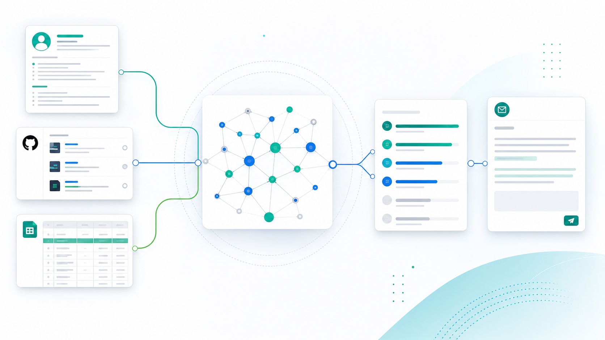
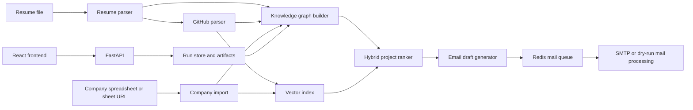

# Job Send Crawl

AI-assisted job outreach automation for developers. Job Send Crawl parses a candidate resume, analyzes GitHub projects, imports company/job records, builds a Neo4j knowledge graph, ranks the best project-company matches, and generates personalized application emails.

<p align="center">
  
</p>

## What This Project Does

Job applications are repetitive, but good outreach still needs context. This project turns candidate data and company data into an explainable matching pipeline:

1. Parse a resume into structured candidate data.
2. Discover and summarize GitHub projects.
3. Import companies and job openings from CSV, JSON, Excel, or Google Sheets.
4. Build a knowledge graph of candidates, projects, technologies, capabilities, companies, roles, and jobs.
5. Index projects and jobs in a vector database.
6. Rank candidate projects against each company using graph, embedding, and LLM scores.
7. Generate personalized email drafts with project links and company-specific reasoning.
8. Queue or dry-run email sending from a frontend cockpit or CLI.

## Highlights

- **End-to-end pipeline:** resume parsing, GitHub parsing, graph build, matching, draft generation, and mail processing.
- **Knowledge graph matching:** Neo4j stores explainable relationships between projects, capabilities, domains, companies, and job requirements.
- **Hybrid ranking:** combines graph overlap, vector similarity, and LLM scoring.
- **Company import workflow:** preview and validate CSV, JSON, Excel, or Google Sheet company data before launching a run.
- **Frontend cockpit:** React/Vite UI for creating runs, monitoring pipeline progress, viewing artifacts, reviewing matches, drafts, companies, and mail queue output.
- **Provider-aware LLM routing:** Groq, OpenAI, and Gemini providers with fallback behavior.
- **Operational services:** Redis for draft queues/rate limiting, Neo4j for graph storage, and Qdrant for vector search.
- **CLI-first backend:** every major module has a thin CLI entrypoint for local automation and debugging.

## Architecture



Core packages:

| Area | Path | Purpose |
| --- | --- | --- |
| Pipeline orchestration | `pipeline/` | Builder-driven pipeline execution and step handlers. |
| API | `app/api/` | FastAPI routes for runs, artifacts, company preview, drafts, mail, and system status. |
| Resume parsing | `app/modules/resume/` | Resume extraction, validation, prompt construction, and parser logic. |
| GitHub parsing | `app/modules/github/` | GitHub profile/project discovery and project summarization. |
| Company imports | `app/modules/company_imports/`, `app/modules/excel/` | CSV/JSON/Excel/Google Sheet import preview and normalization. |
| Knowledge graph | `app/modules/graph/` | Graph models, enrichment, Neo4j persistence, and graph scoring. |
| Vector search | `app/modules/vector/` | Qdrant collections, embeddings, project/job indexing. |
| Matching | `app/modules/matching/` | Hybrid graph/vector/LLM project ranking. |
| Email drafts | `app/modules/emails/` | Personalized draft generation and template utilities. |
| Mail | `app/modules/mail/`, `app/redis/` | Mail sender providers, queue processing, Redis rate limits. |
| Frontend | `frontend/` | React/Vite dashboard for operating the pipeline. |

## Tech Stack

| Layer | Technology |
| --- | --- |
| Backend API | FastAPI |
| Pipeline/runtime | Python |
| Frontend | React, TypeScript, Vite, Tailwind CSS, TanStack Query |
| Graph store | Neo4j |
| Vector store | Qdrant |
| Queue/rate limit | Redis |
| LLM providers | Groq, OpenAI, Gemini |
| Mail providers | SMTP, Resend-compatible provider layer |
| Tests | Pytest, Vitest |

## Quick Start

### 1. Install backend dependencies

```bash
./setup_uv_env.sh
cp .env.example .env
```

The setup script installs `uv` if needed, creates `.venv`, and installs runtime plus test dependencies. Fill in service credentials and API keys in `.env` before running LLM, graph, vector, or mail-backed flows.

### 2. Start infrastructure

```bash
docker compose up -d
./scripts/wait_for_services.sh
```

Local service URLs:

| Service | URL |
| --- | --- |
| Neo4j Browser | `http://localhost:7474` |
| Qdrant | `http://localhost:6333` |

### 3. Run the backend API

```bash
.venv/bin/python -m uvicorn app.api.main:app --reload
```

API root prefix: `http://localhost:8000/api/v1`

### 4. Run the frontend cockpit

```bash
cd frontend
npm install
cp .env.example .env.local
npm run dev
```

Set `VITE_API_BASE_URL=http://localhost:8000/api/v1` in `frontend/.env.local` when the frontend and backend run on separate ports. For UI-only work, set `VITE_USE_MOCKS=true`.

## End-to-End Pipeline

Run the full pipeline from the repository root:

```bash
./scripts/run_pipeline.sh --dry-run
```

Resume from a specific step:

```bash
./scripts/run_pipeline.sh --from-step 5 --dry-run
```

Useful flags:

| Flag | Description |
| --- | --- |
| `--from-step N` | Start at step 1-6. |
| `--company NAME` | Target company. |
| `--recipient-email ADDR` | Draft recipient. |
| `--max-repos N` | GitHub repositories to inspect. |
| `--max-companies N` | Company rows to index in Neo4j. |
| `--clear-graph` | Wipe Neo4j before graph build. |
| `--skip-enrichment` | Skip LLM graph enrichment. |
| `--skip-services` | Skip Neo4j/Qdrant readiness checks. |
| `--dry-run` | Do not send email in the mail step. |
| `--no-enqueue` | Write draft JSON only; skip Redis queue. |

Pipeline outputs are written as JSON artifacts:

| Step | Output |
| --- | --- |
| Parse resume | `parse_resume.json` |
| Parse GitHub | `github_projects_resume.json` |
| Build graph + vectors | `graph_build.json` |
| Rank projects | `matches.json` |
| Generate drafts | `drafts.json` |
| Process mail queue | `mail_queue_result.json` |

## API Overview

The FastAPI app currently exposes the run-oriented cockpit API:

| Method | Path | Purpose |
| --- | --- | --- |
| `GET` | `/api/v1/system/status` | Masked readiness for LLM providers and services. |
| `GET` | `/api/v1/runs` | List pipeline runs. |
| `POST` | `/api/v1/runs/companies/preview` | Preview/validate company imports. |
| `POST` | `/api/v1/runs` | Create and launch a pipeline run. |
| `GET` | `/api/v1/runs/{run_id}` | Get run status, steps, logs, and config. |
| `GET` | `/api/v1/runs/{run_id}/events` | Stream a run snapshot/heartbeat. |
| `POST` | `/api/v1/runs/{run_id}/retry` | Retry a run. |
| `POST` | `/api/v1/runs/{run_id}/resume` | Resume a run. |
| `GET` | `/api/v1/runs/{run_id}/companies` | Get selected company records. |
| `GET` | `/api/v1/runs/{run_id}/artifacts/{artifact_type}` | Fetch resume, GitHub, graph, matches, drafts, or mail artifact JSON. |
| `PUT` | `/api/v1/runs/{run_id}/drafts` | Update generated drafts. |
| `POST` | `/api/v1/runs/{run_id}/drafts/enqueue` | Mark generated drafts queued. |
| `POST` | `/api/v1/runs/{run_id}/mail/process` | Process or dry-run mail queue output. |

## CLI Reference

All CLIs use `cli/bootstrap.py` for import setup. Run from the repo root with `.venv/bin/python -m ...`.

### Company import

```bash
.venv/bin/python -m cli.excel.parse_excel ./companies.xlsx \
  --output-file data/companies_sheet.json
```

### Resume parsing

```bash
.venv/bin/python -m cli.resume.parse_resume ./data/resume.pdf \
  --output-file data/parse_resume.json
```

Use `--text-only` to extract text without structured LLM parsing.

### GitHub parsing

```bash
.venv/bin/python -m cli.github.parse_github ./data/resume.pdf \
  --output-file data/github_projects_resume.json \
  --max-repos 50
```

Set `GITHUB_TOKEN` for reliable GitHub API access. Use `--readme-only` to skip LLM extraction.

### Knowledge graph

```bash
.venv/bin/python -m cli.graph.build_graph \
  --resume data/parse_resume.json \
  --github data/github_projects_resume.json \
  --companies data/companies_sheet.json \
  --clear \
  --output-file data/graph_build.json
```

`--clear` removes all Neo4j nodes before rebuild.

### Matching

```bash
.venv/bin/python -m cli.matching.rank_projects \
  --companies data/companies_sheet.json \
  --company "Acme" \
  --candidate-id candidate:github_username \
  --output-file data/matches.json
```

Read the candidate ID from `graph_build.json` at `candidate.metadata.candidate_id`.

### Email drafts

```bash
.venv/bin/python -m cli.emails.generate_draft \
  --resume data/parse_resume.json \
  --matches data/matches.json \
  --github data/github_projects_resume.json \
  --companies data/companies_sheet.json \
  --company "Acme" \
  --recipient-email hr@example.com \
  --output-file data/drafts.json
```

Generated drafts append a GitHub project links section. Deployed links are preferred when available.

### Mail queue

```bash
.venv/bin/python -m cli.mail.process_queue --dry-run \
  --output-file data/mail_queue_result.json
```

SMTP credentials are required only when sending real email, not for `--dry-run`.

## Programmatic Usage

```python
from pathlib import Path

from pipeline import ApplicationPipelineBuilder, PipelineOptions, PipelineStep

pipeline = (
    ApplicationPipelineBuilder(project_root=Path("."))
    .with_resume("data/resume.pdf")
    .with_companies("data/companies_sheet.json")
    .with_options(PipelineOptions(dry_run=True, from_step=1))
    .build()
)

result = pipeline.run()
print(result.context.matches)
```

Run a custom subset of steps:

```python
result = pipeline.run(
    steps=(
        PipelineStep.PARSE_RESUME,
        PipelineStep.PARSE_GITHUB,
        PipelineStep.BUILD_GRAPH,
    )
)
```

## Configuration

Settings load from environment variables and `.env` through `app/core/settings.py`.

| Group | Variables |
| --- | --- |
| LLM | `GROQ_API_KEY_1`-`4`, `GROQ_MODEL`, `OPENAI_*`, `GEMINI_*` |
| GitHub | `GITHUB_TOKEN` |
| Graph | `NEO4J_URI`, `NEO4J_USER`, `NEO4J_PASSWORD` |
| Vector | `QDRANT_URL`, `EMBEDDING_PROVIDER`, `EMBEDDING_MODEL` |
| Matching | `HYBRID_GRAPH_WEIGHT`, `HYBRID_VECTOR_WEIGHT`, `HYBRID_LLM_WEIGHT` |
| Mail and queue | `MAIL_PROVIDER`, `SMTP_*`, `REDIS_URL`, `EMAIL_QUEUE_KEY` |
| Celery | `CELERY_BROKER_URL`, `CELERY_RESULT_BACKEND` |
| Logging | `LOG_LEVEL`, `LOG_FILE` |

Provider order for the LLM router is Groq keys 1-4, OpenAI, then Gemini. On rate limits, the router pauses that provider and tries the next configured provider.

## Testing

Backend:

```bash
.venv/bin/python -m pytest
```

Focused suites:

```bash
.venv/bin/python -m pytest tests/api
.venv/bin/python -m pytest tests/pipeline
.venv/bin/python -m pytest tests/modules/graph
.venv/bin/python -m pytest tests/modules/matching
.venv/bin/python -m pytest tests/modules/emails
```

Frontend:

```bash
cd frontend
npm run test
npm run build
```

## Documentation

- High-level design: [`doc/HLD.md`](doc/HLD.md)
- Graph architecture: [`app/modules/graph/doc/ARCHITECTURE.md`](app/modules/graph/doc/ARCHITECTURE.md)
- Graph low-level design and zero-score debugging: [`app/modules/graph/doc/LLD.md`](app/modules/graph/doc/LLD.md)

## Project Layout

```text
pipeline/         ApplicationPipelineBuilder and step handlers
app/
  api/            FastAPI app, routes, schemas, and API services
  core/           settings, logging, exceptions, constants
  modules/        excel, resume, github, graph, vector, matching, emails, mail, llm
  celery/         Celery app and task registration
  redis/          email draft queue and rate limiting
cli/              thin CLI entrypoints
frontend/         React/Vite cockpit
prompts/          shared LLM prompt constants
scripts/          run_pipeline.sh and wait_for_services.sh
tests/            backend and frontend-adjacent test suites
doc/              design docs and README assets
```

## Current Frontend Follow-Ups

The cockpit covers the main run workflow today. Known next improvements:

- Add draft editing UI on top of `PUT /runs/{run_id}/drafts`.
- Align draft API client types with the backend's per-company draft dictionary response.
- Replace polling with the existing `/runs/{run_id}/events` stream.
- Add richer graph/match artifact views, including graph paths and zero-score diagnostics.
- Add a run picker for shared pages such as Candidate, Companies, Matches, Drafts, and Queue.

## Status

This project is under active development. The safest operating mode is `--dry-run` until mail credentials and queue behavior are verified for your environment.
