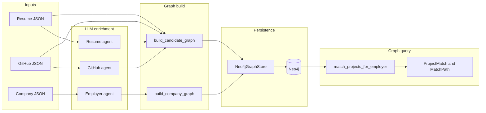

# Graph Module Architecture

Knowledge graph builder for job matching. Ingests parsed resume, GitHub, and Excel company records; optionally enriches them with LLM; materializes nodes and edges in Neo4j; exposes graph-based project matching.

## High-level flow



If Mermaid does not render in your viewer, use this ASCII version:

```
  Resume JSON ──► Resume agent ──┐
  GitHub JSON ──► GitHub agent ──┼──► build_candidate_graph ──┐
                                 │                             ├──► Neo4jGraphStore ──► Neo4j
  Company JSON ──► Employer agent ──► build_company_graph ────┘         │
                                                                          ▼
                                                         match_projects_for_employer
                                                                          │
                                                                          ▼
                                                         ProjectMatch and MatchPath
```

## Entry points

| Function | File | Purpose |
|---|---|---|
| `build_candidate_graph` | `builder.py` | Candidate + projects + resume enrichment → Neo4j |
| `build_company_graph` | `builder.py` | Company / job rows → Neo4j |
| `enrich_github_profile` | `builder.py` | Batch GitHub LLM enrichment |
| `enrich_resume_profile` | `builder.py` | Resume LLM enrichment |
| `build_default_graph_store` | `factory.py` | Neo4j client from env |
| `match_projects_for_employer` | `providers/neo4j.py` | Graph overlap scoring |

Typical orchestration: `cli/graph/build_graph.py` or `app/jobs/build_knowledge_graph.py`.

---

## External inputs

### 1. Parsed resume (`ParsedResume`)

Loaded via `serializers.parsed_resume_from_dict` from JSON (e.g. `data/parse_resume.json`).

| Key | Type | Used by |
|---|---|---|
| `candidate_name` | str | Candidate node name; candidate ID fallback |
| `summary` | str | Candidate node property |
| `skills` | list[str] | Resume enrichment prompt |
| `experience[]` | list | Experience nodes; enrichment |
| `experience[].company_name` | str | Experience node name |
| `experience[].date` | str | Experience properties |
| `experience[].description` | str | Experience properties |
| `projects[]` | list | Resume enrichment; project link matching |
| `projects[].project_name` | str | Enrichment prompt |
| `projects[].link` | str | Match to GitHub `repo_link` |
| `projects[].description` | str | Enrichment prompt |
| `achievements[]` | list[str] | Achievement nodes; enrichment |
| `links.github` | str | **Primary candidate ID source** |
| `links.emails[]` | list | Candidate ID fallback |
| `links.*` | — | Stored on Candidate node |

### 2. Parsed GitHub profile (`ParsedGitHubProfile`)

Loaded via `serializers.parsed_github_from_dict` from JSON (e.g. `data/github_projects_resume.json`).

| Key | Type | Used by |
|---|---|---|
| `github_username` | str | Metadata |
| `github_url` | str | Metadata |
| `projects[]` | list | Project nodes; GitHub enrichment |
| `projects[].repo_name` | str | Project node name |
| `projects[].repo_link` | str | **Project ID key**; enrichment cache key |
| `projects[].deployed_link` | str | Project property |
| `projects[].summary` | str | Project property; LLM prompt |
| `projects[].raw_readme` | str | GitHub enrichment prompt |
| `projects[].tech_stack.backend` | list[str] | Technology nodes (`USES`) |
| `projects[].tech_stack.frontend` | list[str] | Technology nodes |
| `projects[].tech_stack.ai_ml` | list[str] | Technology nodes |
| `projects[].non_tech_tags` | list[str] | Domain nodes (`BELONGS_TO`) |

### 3. Company records (Excel JSON array)

Each record is a normalized dict from the Excel parser (e.g. `data/companies_sheet.json`).

| Key | Type | Required | Used by |
|---|---|---|---|
| `company_name` | str | **Yes** | Company node; enrichment; skip if empty |
| `company_description` | str | No* | Company property; employer LLM |
| `company_url` | str | No | Company ID (`build_company_id`) |
| `job_url` | str | No | JobOpening ID; job node property |
| `job_description` | str | No | JobOpening property; employer LLM |
| `role` | str | No | Role node; job property; employer LLM |
| `hr_email` | str | No | JobOpening property |
| `source_sheet` | str | No | Traceability only |
| `source_row` | int | No | Job ID fallback; traceability |
| `raw_data` | dict | No | Not used by graph builder |

\* At least one of `company_description` or `job_description` is required for LLM employer enrichment.

---

## External outputs

### Graph build result (`GraphBuildResult`)

```json
{
  "nodes_upserted": 233,
  "edges_upserted": 321,
  "metadata": {
    "candidate_id": "candidate:swapnil72902"
  }
}
```

Company build metadata uses `records_processed` instead of `candidate_id`.

### Graph query result (`ProjectMatch` + `MatchPath`)

Returned by `Neo4jGraphStore.match_projects_for_employer`:

| Field | Description |
|---|---|
| `project_id` | e.g. `project:owner/repo` |
| `project_name` | GitHub repo name |
| `graph_score` | 0–1 overlap score |
| `paths[]` | Explainable Cypher paths |
| `paths[].path_labels` | e.g. `Company → OPERATES_IN → web development → BELONGS_TO → Project` |
| `paths[].match_source` | `job` \| `company` \| `domain` |

Hybrid matching (vector + LLM) lives in `app/modules/matching/ranker.py` but reads from this graph store.

---

## Graph ontology

### Node labels

| Label | ID pattern | Source |
|---|---|---|
| `Candidate` | `candidate:{slug}` | Resume links / name |
| `Project` | `project:{owner/repo}` | GitHub `repo_link` |
| `Technology` | `technology:{slug}` | Tech stack + enrichment |
| `Capability` | `capability:{slug}` | LLM enrichment |
| `Domain` | `domain:{slug}` | Tags + LLM enrichment |
| `Experience` | `experience:{candidate_suffix}:{index}` | Resume experience |
| `Achievement` | `achievement:{candidate_suffix}:{hash}` | Resume achievements |
| `Company` | `company:{host_or_name}` | Excel `company_name` / `company_url` |
| `JobOpening` | `job:{company_slug}:{hash_or_row}` | Excel `job_url` / `source_row` |
| `Role` | `role:{slug}` | Excel `role` |
| `OntologyTerm` | `term:{category}:{slug}` | `data/ontology.yaml` aliases |

### Relationships

| Relationship | From → To | Meaning |
|---|---|---|
| `OWNS` | Candidate → Project | Candidate owns GitHub project |
| `HAS` | Candidate → Experience / Achievement | Resume structure |
| `USES` | Project → Technology | Tech stack |
| `DEMONSTRATES` | Project / Experience / Achievement → Capability | Demonstrated skill |
| `BELONGS_TO` | Project → Domain | Project domain |
| `AT` | JobOpening → Company | Job belongs to company |
| `FOR` | JobOpening → Role | Job title |
| `OPERATES_IN` | Company → Domain | Company industry/domain |
| `LOOKS_FOR` | Company → Capability / Technology | Company hiring signals |
| `REQUIRES` | JobOpening / Role → Capability / Technology | Job requirements |
| `IS_A` | Technology / Capability → OntologyTerm | Taxonomy normalization |

Normalization rules: `normalizer.py` + `data/ontology.yaml`.

---

## Sub-processes

### A. GitHub enrichment (`agents/github_enrichment.py`)

**Trigger:** `enrich_github_profile()` before candidate graph build.

| | |
|---|---|
| **Input** | `ParsedGitHubProject` per repo |
| **Input keys** | `repo_name`, `summary`, `tech_stack.*`, `non_tech_tags`, `raw_readme` |
| **LLM** | Groq via `LLMRouter`; JSON schema `GitHubGraphEnrichmentSchema` |
| **Output** | `dict[repo_link → GitHubGraphEnrichment]` |
| **Output keys** | `capabilities`, `domains`, `problems_solved`, `complexity`, `business_impact`, `impact_signals` |
| **Graph use** | `capabilities` → `DEMONSTRATES`; `domains` → `BELONGS_TO` on Project |

### B. Resume enrichment (`agents/resume_enrichment.py`)

**Trigger:** `enrich_resume_profile()` before candidate graph build.

| | |
|---|---|
| **Input** | `ParsedResume` + optional `ParsedGitHubProfile` |
| **Input keys** | `candidate_name`, `skills`, `experience[]`, `achievements[]`, `projects[]`, GitHub `repo_link` list |
| **LLM** | `ResumeGraphEnrichmentSchema` |
| **Output** | `ResumeGraphEnrichment` |
| **Output keys** | `experience_capabilities` (index → caps), `achievement_capabilities`, `project_links` (index → repo_link), `skill_technologies` |
| **Graph use** | Experience/Achievement nodes + `DEMONSTRATES`; extra `OWNS` edges from resume projects to GitHub projects |

### C. Employer enrichment (`agents/employer_enrichment.py`)

**Trigger:** `resolve_employer_enrichment()` inside `build_company_graph` (per row, cached by `company_name.lower()`).

| | |
|---|---|
| **Input** | `EmployerEnrichmentInput` |
| **Input keys** | `company_name`, `company_description`, `job_description`, `role` |
| **Mode** | `company` \| `job` \| `both` (auto from available text) |
| **LLM** | `EmployerEnrichmentSchema` |
| **Output** | `EmployerEnrichmentResult` |
| **Output keys** | `company_domains`, `company_looked_for_capabilities`, `company_looked_for_technologies`, `job_required_capabilities`, `job_required_technologies`, `industry`, `enrichment_source` |
| **Graph use** | See employer builder mapping below |

### D. Candidate graph build (`builder.build_candidate_graph`)

| Step | Input keys | Output nodes/edges |
|---|---|---|
| Resolve ID | `links.github`, `links.emails[0]`, `candidate_name` | `Candidate` node |
| For each GitHub project | `repo_link`, `repo_name`, `summary`, `tech_stack`, `non_tech_tags`, enrichment | `Project`, `Technology`, `Domain`, `Capability`; `OWNS`, `USES`, `BELONGS_TO`, `DEMONSTRATES` |
| Resume enrichment pass | `experience[]`, `achievements[]`, enrichment maps | `Experience`, `Achievement`; `HAS`, `DEMONSTRATES`; resume `OWNS` |
| Persist | deduped nodes/edges | Neo4j upsert counts |

### E. Company graph build (`employer_builder.build_employer_nodes_and_edges`)

| Step | Input keys | Output |
|---|---|---|
| Skip guard | `company_name` empty → no nodes | — |
| Company node | `company_name`, `company_url`, `company_description` | `Company` |
| Job node | `job_url`, `job_description`, `role`, `hr_email`, `source_row` | `JobOpening`; `AT` → Company |
| Role node | `role` | `Role`; `FOR` ← JobOpening |
| Company enrichment | `company_domains` | `OPERATES_IN` → Domain |
| Company enrichment | `company_looked_for_capabilities` | `LOOKS_FOR` → Capability |
| Company enrichment | `company_looked_for_technologies` | `LOOKS_FOR` → Technology |
| Job enrichment | `job_required_capabilities` | `REQUIRES` → Capability (Job + Role) |
| Job enrichment | `job_required_technologies` | `REQUIRES` → Technology |

### F. Entity builders (`entity_builder.py`)

Shared primitives used by candidate and employer paths:

| Function | Input | Relationship | Output |
|---|---|---|---|
| `project_node_and_edges` | `candidate_id`, `ParsedGitHubProject`, `GitHubGraphEnrichment?` | `OWNS`, `USES`, `BELONGS_TO`, `DEMONSTRATES` | Project subgraph |
| `technology_nodes_and_edges` | `source_id`, tech labels | `USES` (+ `IS_A` → OntologyTerm) | Tech nodes |
| `capability_nodes_and_edges` | `source_id`, caps, `relationship` | `DEMONSTRATES` / `LOOKS_FOR` / `REQUIRES` | Capability nodes |
| `domain_nodes_and_edges` | `source_id`, domains, `relationship` | `BELONGS_TO` / `OPERATES_IN` | Domain nodes |
| `technology_requirement_edges` | Same as tech, different rel | `LOOKS_FOR` / `REQUIRES` | Tech requirement edges |

### G. Persistence (`utils.persist_graph` → `Neo4jGraphStore`)

| Step | Input | Output |
|---|---|---|
| `dedupe_nodes` | `GraphNode[]` keyed by `node_id` | Unique nodes |
| `dedupe_edges` | `GraphEdge[]` keyed by `(source, target, rel)` | Unique edges |
| `upsert_nodes` | Grouped by `label` | MERGE in Neo4j |
| `upsert_edges` | Grouped by `relationship` | MERGE relationships |

### H. Graph matching (`providers/neo4j.match_projects_for_employer`)

| | |
|---|---|
| **Input** | `EmployerProfile` (`company_id`, `company_name`, `job_id`, `job_description`, `role`) + `candidate_id` |
| **Built from** | Excel keys via `matching/ranker._build_employer_profile` |
| **Queries** | (1) Job `REQUIRES` → Capability ← Project `DEMONSTRATES` (weight 0.7 if JD present) |
| | (2) Company `LOOKS_FOR` → Capability (weight 0.3 or 1.0) |
| | (3) Company `OPERATES_IN` → Domain ← Project `BELONGS_TO` (weight 0.3 or 0.5) |
| **Output** | `(list[ProjectMatch], list[MatchPath])` sorted by `graph_score` |

---

## Configuration (env keys)

| Env var | Used by | Default |
|---|---|---|
| `NEO4J_URI` | `GraphConfig` | `bolt://localhost:7687` |
| `NEO4J_USER` | `GraphConfig` | `neo4j` |
| `NEO4J_PASSWORD` | `GraphConfig` | **required** |
| `HYBRID_GRAPH_WEIGHT` | Matching weights | `0.4` |
| `HYBRID_VECTOR_WEIGHT` | Matching (external) | `0.3` |
| `HYBRID_LLM_WEIGHT` | Matching (external) | `0.3` |

LLM keys (`GROQ_API_KEY_*`) are read by `app/modules/llm`, not this module directly.

---

## File map

```
app/modules/graph/
├── builder.py              # Orchestration: candidate + company graph
├── employer_builder.py     # Excel row → company/job subgraph
├── entity_builder.py       # Reusable node/edge factories
├── normalizer.py           # ID slugs + ontology normalization
├── model.py                # Dataclasses (nodes, edges, enrichments)
├── schemas.py              # Pydantic LLM output schemas
├── serializers.py          # JSON → ParsedResume / ParsedGitHubProfile
├── utils.py                # Dedupe + persist
├── ontology.py             # Load ontology.yaml
├── interface.py            # GraphStore protocol
├── factory.py              # Neo4j store factory
├── config.py               # GraphConfig from env
├── providers/neo4j.py      # Neo4j implementation + matching
├── agents/                 # LLM enrichment agents
│   ├── github_enrichment.py
│   ├── resume_enrichment.py
│   └── employer_enrichment.py
├── prompts/                # System + user prompt templates
├── data/ontology.yaml      # Technology/capability taxonomy
└── doc/ARCHITECTURE.md     # This document
```

---

## Example end-to-end (first company)

```
Excel parse (--header-row 2)
  → company_name: "100Starlings"
  → company_description, company_url, job_url

build_candidate_graph
  → candidate:swapnil72902
  → 33 Project nodes + capabilities/domains/technologies

build_company_graph (max_records=1)
  → company:100starlings.com
  → job:{hash}
  → OPERATES_IN → "web development"
  → LOOKS_FOR → capabilities from LLM

match_projects_for_employer
  → path: 100Starlings → web development → Aryan-coder-student
```
