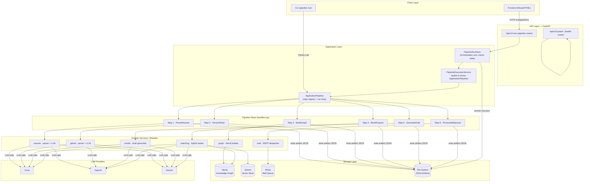
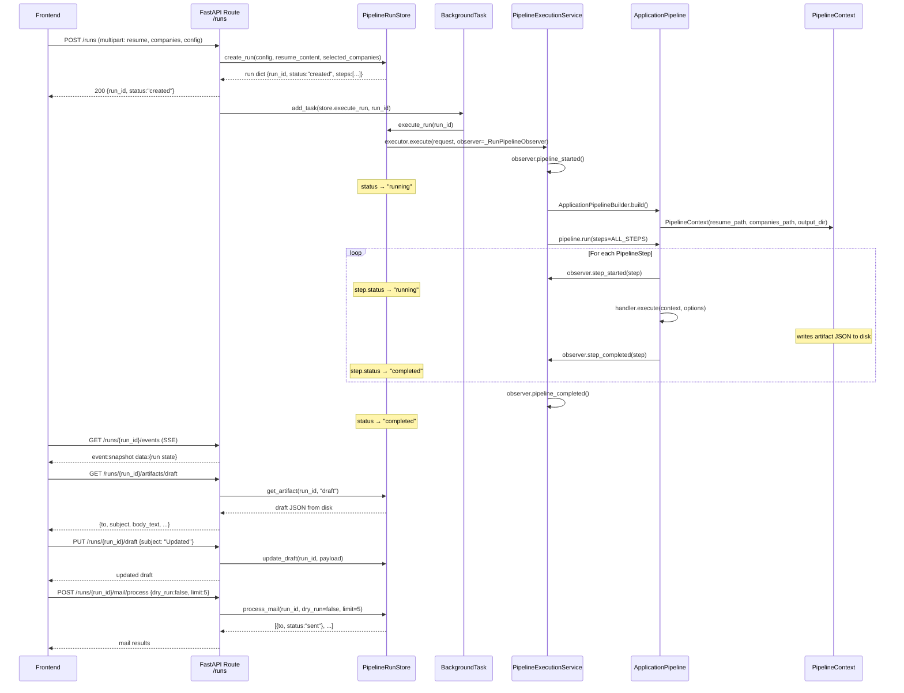

# High Level Design (HLD) — Job Send Crawl

> **System Purpose**: An AI-driven job-application pipeline that takes a candidate's résumé and a list of target companies, enriches each with GitHub activity and company data, ranks the best-matching projects via a hybrid graph + vector + LLM scorer, and then generates and optionally dispatches a personalised cold-outreach email.

---

## 1. Functional Requirements

| # | Requirement |
|---|-------------|
| FR-01 | Accept a résumé file (PDF/DOCX) and parse it into a structured candidate profile using an LLM. |
| FR-02 | Discover and parse the candidate's GitHub repositories, extract project descriptions, skills and relevance signals. |
| FR-03 | Accept a company list (Excel/CSV/JSON) defining target employers, roles, job URLs and descriptions. |
| FR-04 | Build a knowledge graph that links the candidate, their projects, and each target employer via skill/technology edges. |
| FR-05 | Rank candidate projects against each employer using a hybrid scorer (graph traversal + vector similarity + LLM reasoning). |
| FR-06 | Generate a personalised cold-outreach draft email for the highest-ranked company, optionally enqueuing it for sending. |
| FR-07 | Process the email queue and dispatch messages via SMTP / a configured mail provider. |
| FR-08 | Allow the pipeline to be resumed from any step to avoid re-running expensive upstream steps after a failure. |
| FR-09 | Expose all pipeline operations via a REST API so a frontend can drive, monitor, and inspect runs. |
| FR-10 | Surface step-level status, artifacts, and logs in real time to the requesting client (SSE stream). |
| FR-11 | Allow the user to view, edit, and manually enqueue a draft email before it is sent. |
| FR-12 | Preview and validate a company upload before committing it to a run. |
| FR-13 | Report the configuration status of all external services (LLM providers, databases, mail). |

---

## 2. Non-Functional Requirements

| # | Category | Requirement |
|---|----------|-------------|
| NFR-01 | **Extensibility** | Each pipeline step is an independent `BaseStepHandler` registered via a mapping; new steps can be added without modifying existing code (Open-Closed Principle). |
| NFR-02 | **Resumability** | Artifacts (JSON snapshots) are written to disk after every step, enabling the pipeline to reload state and skip completed steps. |
| NFR-03 | **Observability** | The `PipelineStepObserver` protocol decouples status reporting from execution, allowing any observer (API store, CLI logger, etc.) to track progress. |
| NFR-04 | **LLM Fault Tolerance** | The LLM router supports multiple providers (Groq, OpenAI, Gemini) with automatic provider rotation on rate-limit / failure. |
| NFR-05 | **Thread Safety** | `PipelineRunStore` uses a `threading.Lock` to serialise in-memory run mutations, enabling safe background-task execution alongside concurrent API requests. |
| NFR-06 | **Dry-Run Mode** | All mail-dispatch operations support a `dry_run` flag so the full pipeline can be exercised without sending real emails. |
| NFR-07 | **Storage Portability** | Run metadata is persisted as flat JSON files (`runs/runs.json`); no relational database is required for basic operation. |
| NFR-08 | **Configurability** | Every pipeline parameter (`max_repos`, `top_matches`, `skip_enrichment`, …) is surfaced as an API form field and a CLI flag. |
| NFR-09 | **Performance** | Hybrid ranking combines pre-computed graph traversals with vector ANN search to avoid full re-embedding on every request. |
| NFR-10 | **Security** | API keys for LLM providers and SMTP credentials are loaded exclusively from environment variables / `.env`; they are never stored in code or artifacts. |

---

## 3. System Architecture Overview



---

## 4. Services — Inputs, Outputs & Responsibilities

### 4.1 `resume` — Resume Parser Service

| | Detail |
|-|--------|
| **Module** | `app/modules/resume/parser.py` |
| **Triggered by** | `ParseResumeStep` (Step 1) |
| **Input** | PDF/DOCX résumé file path + `ResumeParserConfig` |
| **Processing** | Reads raw file bytes → sends text to LLM with structured-extraction prompt → returns `ParsedResume` Pydantic model |
| **Output** | `ParsedResume` object (name, skills, experience, projects, links); also serialised to `parse_resume.json` |
| **Why** | Converts unstructured text into a typed data model that every downstream step can rely on. |

---

### 4.2 `github` — GitHub Profile Parser

| | Detail |
|-|--------|
| **Module** | `app/modules/github/parser.py` |
| **Triggered by** | `ParseGitHubStep` (Step 2) |
| **Input** | `ParsedResume` (used to discover GitHub username/URL) + `GitHubParserConfig(max_repos)` |
| **Processing** | Calls GitHub REST API → fetches up to `max_repos` repositories → summarises each repo via LLM → builds `ParsedGitHubProfile` |
| **Output** | `ParsedGitHubProfile` with a list of `GitHubProject` objects; serialised to `github_projects_resume.json` |
| **Why** | Augments the résumé profile with real, verifiable open-source contributions that are used for graph and vector matching. |

---

### 4.3 `graph` — Knowledge Graph Builder

| | Detail |
|-|--------|
| **Module** | `app/modules/graph/` (builder, entity_builder, employer_builder) |
| **Triggered by** | `BuildGraphStep` (Step 3) |
| **External services** | **Neo4j** (graph DB), **Qdrant** (vector store) |
| **Input** | `parsed_resume` dict, `parsed_github` dict, `company_records` list, config flags (`max_companies`, `skip_enrichment`, `clear_graph`) |
| **Processing** | 1. Creates `Candidate` node + `Project` nodes in Neo4j with skill edges. 2. Optionally enriches companies by scraping public web context via LLM. 3. Creates `Employer` + `Job` nodes with technology/domain edges. 4. Embeds each project into Qdrant for later vector search. |
| **Output** | `graph_result` dict (candidate metadata including `candidate_id`); serialised to `graph_build.json` |
| **Why** | The graph encodes semantic relationships (shared skills, domains, tech stacks) that pure text matching cannot capture. |

---

### 4.4 `matching` — Hybrid Project Ranker

| | Detail |
|-|--------|
| **Module** | `app/modules/matching/ranker.py` |
| **Triggered by** | `RankProjectsStep` (Step 4) |
| **External services** | **Neo4j** (graph traversal), **Qdrant** (ANN vector search), **LLM Router** |
| **Input** | `candidate_id`, `company_records`, `target_company`, optional `job_url`, `top_matches` limit |
| **Processing** | For each target company: (1) graph traversal → `graph_score`; (2) embed job description → Qdrant ANN search → `embedding_score`; (3) LLM prompt with both signals → `llm_score`. Final score = weighted combination of all three. |
| **Output** | Ranked `list[ProjectMatch]` with scores and explanations; serialised to `matches.json` |
| **Why** | Three independent signals reduce the chance of a single-modality failure and produce explainable rankings. |

---

### 4.5 `emails` — Draft Generator

| | Detail |
|-|--------|
| **Module** | `app/modules/emails/tasks/runner.py` |
| **Triggered by** | `GenerateDraftStep` (Step 5) |
| **Input** | `parsed_resume` dict, `target_company`, ranked `matches`, `company_records`, GitHub projects, `recipient_email`, `enqueue` flag |
| **Processing** | Builds a structured prompt from résumé + top matches + company context → calls LLM to generate a personalised email draft → optionally enqueues into Redis mail queue |
| **Output** | `draft` dict (`to`, `subject`, `body_text`, `body_html`, `draft_id`, `status`); serialised to `draft.json` |
| **Why** | Personalisation at scale requires LLM generation; enqueuing separates generation from dispatch so drafts can be reviewed/edited first. |

---

### 4.6 `mail` — Mail Queue Processor

| | Detail |
|-|--------|
| **Module** | `app/modules/mail/tasks/runner.py` |
| **Triggered by** | `ProcessMailQueueStep` (Step 6) |
| **External services** | **Redis** (queue), **SMTP** (mail provider) |
| **Input** | `mail_limit`, `dry_run` flag |
| **Processing** | Pops up to `limit` items from the Redis queue → for each: constructs MIME message and sends via SMTP (or skips if `dry_run=True`) |
| **Output** | `list[mail_result]` with `to`, `status`, `draft_id` per sent/skipped item; serialised to `mail_queue_result.json` |
| **Why** | Decoupling dispatch from generation enables retry, throttling, and dry-run testing without any infrastructure change. |

---

## 5. Application Layer — `ApplicationPipeline`

The application layer is the glue between the API and the domain services. It has three collaborators:

```
PipelineRunStore  →  PipelineExecutionService  →  ApplicationPipeline
     (API store)          (bridge / builder)           (step runner)
```

| Component | Role |
|-----------|------|
| **`PipelineRunStore`** | In-memory run registry backed by `JsonRunRepository`. Creates runs, tracks step/run status, manages artifact paths, exposes methods the API routes call. |
| **`PipelineExecutionService`** | Translates a `PipelineExecutionRequest` (from the store) into a built `ApplicationPipeline` and calls `pipeline.run()`. Fires `PipelineExecutionObserver` callbacks so the store always knows current state. |
| **`ApplicationPipeline`** | Owns the step registry (`Mapping[PipelineStep, BaseStepHandler]`). On `run()`: validates steps → checks service readiness → loads artifact state if resuming → iterates steps, calling `handler.validate()` then `handler.execute()` for each, notifying the observer. |
| **`PipelineContext`** | Shared mutable state bag threaded through every step. Holds typed fields for each step's output (`parsed_resume`, `parsed_github`, `graph_result`, `matches`, `draft`, `mail_results`) and convenience paths for artifact I/O. |
| **`PipelineOptions`** | Immutable frozen dataclass of configuration knobs. `resolved_steps()` computes which steps to execute based on `from_step` and any explicit step override. |

---

## 6. Storage Layer

### 6.1 Neo4j — Knowledge Graph

- **Purpose**: Stores `Candidate`, `Project`, `Employer`, `Job` nodes connected by `:HAS_SKILL`, `:USES_TECH`, `:SHARES_DOMAIN` edges.
- **Used by**: Steps 3 (write) and 4 (read via graph traversal).
- **Why graph?**: Relationship-based matching — "this project and that job both use Rust + async networking" — is naturally expressed as graph paths, not table joins.

### 6.2 Qdrant — Vector Store

- **Purpose**: Stores dense embeddings of each candidate project. Used for ANN (Approximate Nearest Neighbour) similarity search against employer/job description embeddings.
- **Used by**: Steps 3 (write project embeddings) and 4 (query).
- **Collection**: `projects` (configurable via `VectorConfig`).

### 6.3 Redis — Mail Queue

- **Purpose**: Holds serialised email draft payloads ready for dispatch. Decouples draft generation (Step 5) from actual sending (Step 6).
- **Used by**: Steps 5 (enqueue) and 6 (dequeue + send).

### 6.4 File System — JSON Artifacts & Run Manifest

- **Purpose**: Durable, human-readable snapshots of every step's output.
- **Structure**:
  ```
  data/
  ├── runs/
  │   ├── runs.json                  # run manifest (all run records)
  │   └── <run_id>/
  │       ├── uploads/resume.pdf
  │       └── artifacts/
  │           ├── parse_resume.json
  │           ├── github_projects_resume.json
  │           ├── graph_build.json
  │           ├── matches.json
  │           ├── draft.json
  │           └── mail_queue_result.json
  └── companies_sheet.json           # (legacy / demo data)
  ```
- **Why flat files?**: Zero infrastructure requirement for basic operation; artifacts can be inspected, edited, and replayed without a database.

---

## 7. REST API Endpoints

All endpoints are prefixed `/api/v1`.

### 7.1 System Router — `/system`

| Method | Path | Purpose |
|--------|------|---------|
| `GET` | `/system/status` | Returns configuration health of all external services (LLM providers, Neo4j, Qdrant, Redis, mail). Used by the frontend on startup to warn the user of misconfigured services before a run. |

---

### 7.2 Pipeline Router — `/runs`

| Method | Path | Purpose & Why |
|--------|------|---------------|
| `GET` | `/runs` | **List all runs.** Returns every `PipelineRunRecord` sorted newest-first. The frontend uses this to populate the run history sidebar. |
| `POST` | `/runs` | **Create and start a new run.** Accepts a multipart form with the résumé file, company list, and all pipeline configuration knobs. Saves upload files, creates a run record, then fires the full pipeline in a FastAPI `BackgroundTask` so the HTTP response is immediate. Returns the new run dict. |
| `POST` | `/runs/companies/preview` | **Preview a company upload.** Validates the Excel/CSV before the user commits it to a run. Returns normalised rows with `is_valid` flags so the frontend can show a table preview and let the user deselect rows. |
| `GET` | `/runs/{run_id}` | **Get a single run.** Returns the full `PipelineRunRecord` (status, step states, config, logs, artifact paths). Polled or used after SSE disconnect. |
| `GET` | `/runs/{run_id}/events` | **Stream run events (SSE).** Immediately emits a `snapshot` event with the current run state, then a `heartbeat`. Clients use this for live progress without polling. |
| `POST` | `/runs/{run_id}/retry` | **Retry a failed run from step 1.** Resets all step statuses to `pending`, then re-executes the full pipeline in the background. Used when a transient error (e.g. LLM timeout) caused the entire run to fail. |
| `POST` | `/runs/{run_id}/resume` | **Resume a run from a specific step.** Accepts `{ "from_step": 3 }`. Resets statuses and re-executes starting at the given step, loading artifact state for prior steps from disk. Saves cost when only a downstream step failed. |
| `GET` | `/runs/{run_id}/companies` | **Get the company list for a run.** Returns the normalised company records that were loaded into this run's context. Used by the frontend to display which companies were targeted. |
| `GET` | `/runs/{run_id}/artifacts/{artifact_type}` | **Fetch a step artifact.** `artifact_type` is one of `resume`, `github`, `graph`, `matches`, `draft`, `mail`. Returns the raw JSON blob so the frontend can render step-level results (e.g. display the generated email draft). |
| `PUT` | `/runs/{run_id}/draft` | **Edit the generated draft.** Accepts `{ "to", "subject", "body_text", "body_html" }`. Merges changes into the stored draft. Allows the user to manually refine the AI-generated email before sending. |
| `POST` | `/runs/{run_id}/draft/enqueue` | **Enqueue the draft for sending.** Sets draft `status = "queued"`. The next call to `process` (or Step 6) will pick it up. Separates user approval from automatic dispatch. |
| `POST` | `/runs/{run_id}/mail/process` | **Trigger mail dispatch for a run.** Accepts `{ "dry_run": bool, "limit": int }`. Reads the mail artifact or draft and dispatches emails. Returns a list of mail results. |

---

## 8. API → Pipeline Module Interaction Diagram


